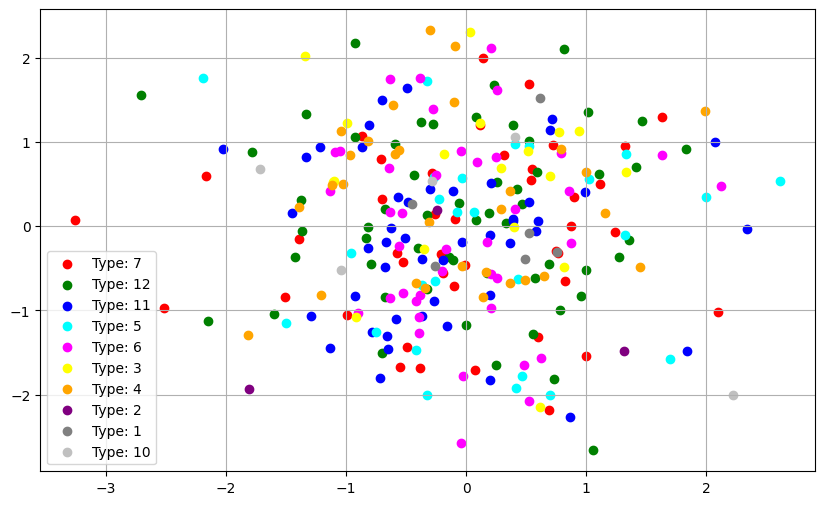
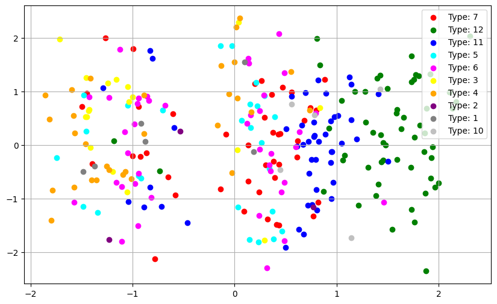
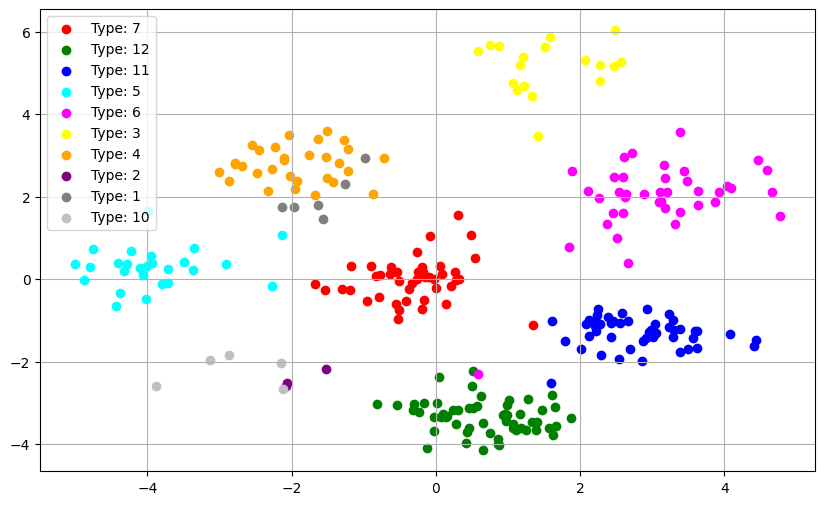
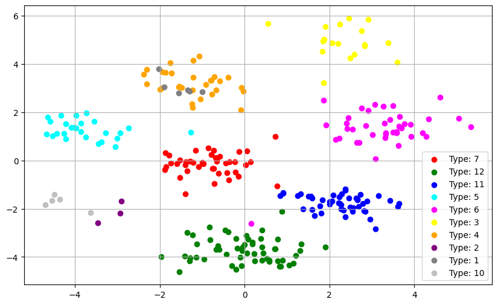
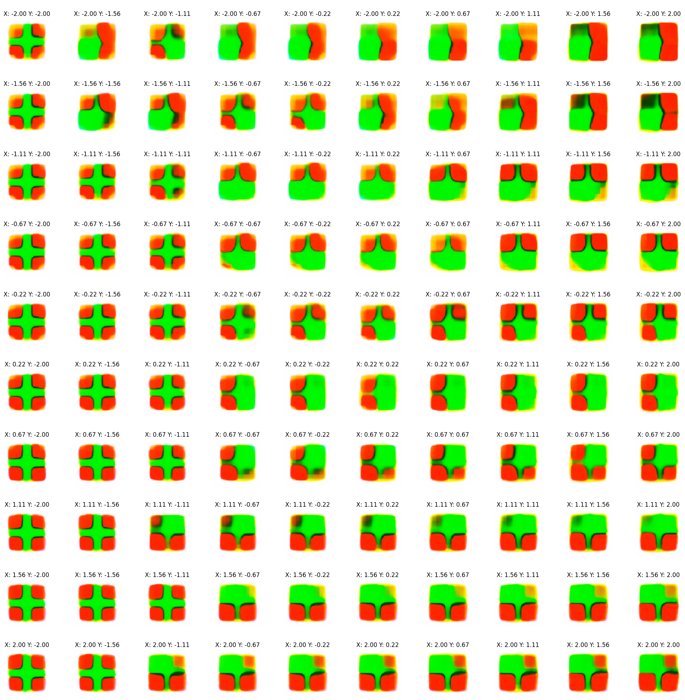

# CategoricalMoESafranbolu
Source code for the paper **Probabilistic Clustering of Safranbolu House Typologies using Categorical Linear Layers and Mixture of Experts** (currently under review).

## Dataset
Available upon request.

## Authors
H. Fuat Alsan
(corresponding e-mail: huseyinfuat.alsan@stu.khas.edu.tr)

Ebru Ece Keskin 

Prof. Dr. E. Füsun Alioğlu

Assoc. Prof. Dr. Taner Arsan

Asst. Prof. Dr. Figen Özen

Arçın Baray Karaca

Assoc. Prof. Dr. Sabri Gökmen

## Type Clusters
#### MoE AE Clusters

#### MoE AE with Classification Clusters

#### Categorical MoE AE Clusters

#### Categorical MoE AE with Classification Clusters

## Generated Floor Plans (Typology Overview) 
